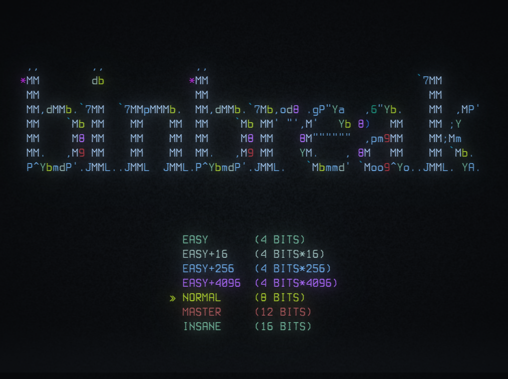

Guess the correct number (from binary to decimal) before time runs out!


Or lose a life trying.


Includes 16-bit mode as well, when you feel a little bit insane.


Includes multiple 4-bit modes, to train individual nibbles.


## Can you crack the high score?
High scores are tracked for each game-mode separately, and saved in a text file relative to the executable.

## Play
Download the release for your platform, see [Releases](https://github.com/epic-64/binbreak/releases).  
There is one file for linux and one for windows (.exe).

## Linux
- download the file `binbreak-linux`
- open a terminal and navigate to the folder where you downloaded it, e.g. `cd ~/Downloads`
- make it executable: `chmod +x binbreak-linux`
- run the game: `./binbreak-linux`

Instead of relying on prebuilt binaries, you can also build from source.

## Retro aesthetics
For the best experience, I recommend using Cool Retro Terminal on Linux, or Windows Terminal in Retro mode.  
But the game should run fine in any terminal.

## Build/Run from source
- download the source code
- make sure you have Rust and Cargo installed, see [rustup.rs](https://rustup.rs/)
- open a terminal and navigate to the folder where you downloaded the source code, e.g. `cd ~/Downloads/binbreak`
- build the project: `cargo build --release`

## Run
```bash
cargo run --release
```

## Test
```bash
cargo test
```

[](https://ratatui.rs/)